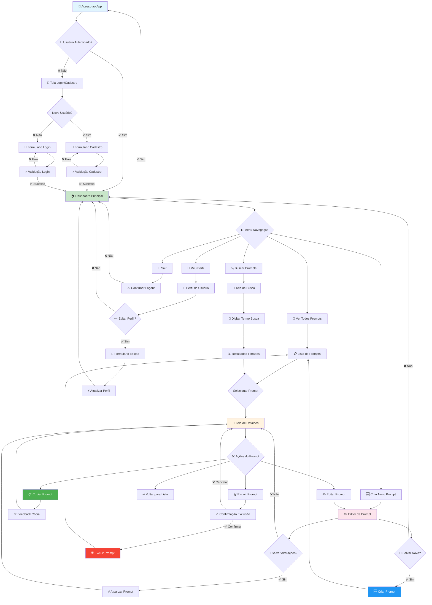

# PRD COMPLETO + FLOWCHART - App de Gestão de Prompts

## 📋 PRODUCT REQUIREMENTS DOCUMENT

### 🎯 Visão Geral
Sistema completo de gerenciamento de prompts com autenticação, CRUD e funcionalidade de cópia rápida. Desenvolvido no Lovable com migração para Xano 2.0.

### ✨ Funcionalidades Principais

#### 1. 🔐 Sistema de Autenticação
- Cadastro com email, senha e nome
- Login/Logout com sessão segura
- Rotas protegidas por autenticação
- Gestão básica de perfil

#### 2. 📝 Gestão Completa de Prompts (CRUD)
- **Criar**: Interface intuitiva para novos prompts
- **Ler**: Visualização com busca e filtros
- **Atualizar**: Edição completa de prompts
- **Excluir**: Remoção segura com confirmação

#### 3. 📋 Copiar com Um Clique
- Botão de copiar visível em todos os prompts
- Feedback visual imediato (toast)
- Formatação preservada na clipboard

#### 4. 🏷️ Organização e Busca
- Sistema de categorias
- Tags múltiplas por prompt
- Busca em tempo real
- Filtros por categoria/tags

## 🔄 FLOWCHART UX COMPLETO



## 🗃️ ESTRUTURA DE DADOS

### Tabela: usuarios
```json
{
  "id": "UUID",
  "criado_em": "DateTime",
  "nome": "Texto",
  "email": "Email",
  "senha": "Senha (hash)",
  "ultimo_login": "DateTime"
}
```

### Tabela: prompts
```json
{
  "id": "UUID",
  "usuario_id": "UUID (FK)",
  "titulo": "Texto",
  "descricao": "Texto",
  "conteudo": "Texto",
  "categoria": "Texto",
  "tags": "Array[Texto]",
  "template": "Boolean",
  "publico": "Boolean",
  "criado_em": "DateTime",
  "atualizado_em": "DateTime"
}
```

## 🚀 FLUXOS DETALHADOS

### 🔐 Fluxo de Autenticação
```
Acesso → Verifica Sessão → Se Não Logado: Login/Cadastro → Validação → Dashboard
Se Logado: Dashboard Direto
```

### 📝 Fluxo de Criação
```
Dashboard → Criar Novo → Editor → Preencher → Salvar → Lista
```

### 🔍 Fluxo de Busca e Cópia
```
Dashboard → Buscar → Digitar → Resultados → Selecionar → Copiar → ✅
```

### ✏️ Fluxo de Edição
```
Lista → Selecionar → Detalhes → Editar → Editor → Salvar → Detalhes Atualizados
```

### 🗑️ Fluxo de Exclusão
```
Detalhes → Excluir → ⚠️ Confirmação → ✅ Confirmar → Excluir → Volta Lista
```

## 🎨 ESTADOS DA INTERFACE

### 🟢 Estados de Sucesso
- ✅ Login válido
- ✅ Cadastro concluído
- ✅ Prompt criado/editado
- ✅ Cópia realizada
- ✅ Perfil atualizado

### 🔴 Estados de Erro
- ❌ Login inválido
- ❌ Email já cadastrado
- ❌ Campos obrigatórios vazios
- ❌ Erro de conexão

### ⚠️ Estados de Confirmação
- ⚠️ Exclusão de prompt
- ⚠️ Logout
- ⚠️ Descartar alterações

### 🔄 Estados de Carregamento
- 🔄 Autenticação
- 🔄 Salvamento
- 🔄 Busca
- 🔄 Cópia para clipboard

## 🔧 PRÓXIMOS PASSOS

### Fase 1 - Configuração Xano
- 🗃️ Criar tabelas usuarios e prompts
- 🔗 Configurar relação 1:N
- 🚀 Desenvolver APIs RESTful

### Fase 2 - Integração
- 🔌 Conectar Lovable às APIs Xano
- 🧪 Testar fluxo completo
- 🎯 Migrar dados mock

### Fase 3 - Polimento
- 🐛 Correção de bugs
- ⚡ Otimização performance
- 📱 Responsividade final
